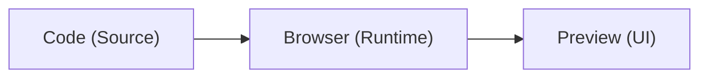

### Overview

The following project takes a look at how I enabled Google's Migration Center transformation and modernization. Modernization, and by it's extension, the practice of lifing and modernization of infrasturcture is one of the most modern ways to look at your infrastructure, and deploy changes to the environment.

**Period of work: April 2025 - Current**<br>
**Type of Engagement: UX conceptual Mockups + Programme Definition**

## Understanding the domain

### Hello World to HTML
Let’s take a step back and strip things down to their simplest form. For many of us, the very first interaction with code wasn’t a complex software architecture or a multi-layered cloud system. It was a humble “Hello, World!” program — perhaps written on Scratch with colorful blocks, or a basic website built using HTML and CSS.

There was a certain charm to it. You’d write a few lines of code, double-click the .html file, and instantly see your creation come alive in a browser. This cycle of write → preview → iterate felt intuitive and magical.

<!-- <div style="display: flex; justify-content: center; margin: 20px 0;">
<iframe height="400" style="width: 100%;" scrolling="no" title="Hello World" src= "https://scratch.mit.edu/projects/1203843594/" frameborder="no" loading="lazy" allowtransparency="true" allowfullscreen="true">
</iframe>
</div> -->

<div style="display: flex; justify-content: center; margin: 20px 0;">
<iframe height="400" style="width: 100%;" scrolling="no" title="Hello World" src="https://codesandbox.io/embed/48zdgn?view=editor+%2B+preview&module=%2Findex.html&hidenavigation=1" frameborder="no" loading="lazy" allowtransparency="true" allowfullscreen="true">
</iframe>
</div>
Figure 1: A simple Hello World CodePen, try changing values on the left to see how the preview changes.

What’s fascinating is how these small experiments already reflected core patterns of larger systems. You had code (the source), you had a domain (the browser acting as the runtime), and you had a preview (the user interface). This simple loop is still the essence of how applications, no matter how complex, operate today.


### Scaling Up: The Layers Begin

Now, imagine you're working on Bamazon.com, a fictional e-commerce site.

* At first, it feels like it’s just more of the same:
  * You have some HTML/CSS.
  * A dash of JavaScript for interactivity.

But then questions start popping up:

* Where does the product data come from?
  * Where is the “Add to Cart” state stored?
  * How does it remember my cart when I refresh the page?

<div style="width: 100%; max-width: 800px; margin: 0 auto; border-radius: 12px; overflow: hidden; box-shadow: 0 0 10px rgba(0,0,0,0.1);">
  <iframe 
    src="https://editor.p5js.org/yashraj.p.wadalkar/full/o3sknZ0Kz"
    style="width: 100%; height: 450px; border: none; overflow: hidden;"
    scrolling="no"
    sandbox="allow-scripts allow-same-origin allow-popups"
    loading="lazy"
  ></iframe>
</div>

*Figure: AN abstraction of the different layers that can comprise a web application.*

### From Monoliths to Internal Developer Platforms (IDPs)

Not long ago, most apps ran on monolith servers¹—single systems where everything was bundled together. This made scaling and updating difficult.
The shift began with virtualization², allowing us to split large servers into smaller, isolated environments. Eventually, cloud computing made infrastructure more dynamic and scalable.

* Today, with increasing complexity, teams rely on Internal Developer Platforms (IDPs³). These platforms provide:
  * Golden Images⁴ (pre-configured environments),
  * Automated CI/CD Pipelines⁵,
  * Embedded best practices.

The goal? Minimize infrastructure hassle, so developers can focus on building and shipping software quickly and reliably.
We’ve moved from manual, monolithic management to self-service, automated platforms that streamline development from code to production.

*Figure: Use the slider to differentiate between how the Virtual machines were virtualized in diffferent eras.*

### Understanding Enterprise Applications
```
sequenceDiagram
    participant User as Users of Application
    participant Org as Organization Identity
    participant AppServices as Application Services
    participant Arch as Architecture Style
    participant Biz as Business Purpose
    participant Infra as Infrastructure Types
    participant Comm as Service Communication
    participant BCP as Business Continuity (DR/HA)
    participant Ops as Application Operations
    participant Observability as Observability & Monitoring
    participant CICD as CI/CD & DevOps

    User->>Org: Authenticate & Authorize
    User->>AppServices: Access Application Services

    AppServices->>Arch: Define Architecture Style
    Arch->>Biz: Align with Business Purpose

    Biz->>Infra: Define Environment
    Infra->>Infra: VMs, Containers, Serverless Functions
    Infra->>Infra: App Service, App Engine
    Infra->>Infra: Kubernetes Services
    Infra->>Infra: Peak & Average VM Sizing

    Infra->>Comm: Enable Service Communication
    Comm->>Comm: Cross-Cloud Connectivity
    Comm->>Comm: DNS, Load Balancing, Firewall

    Comm->>BCP: Ensure Disaster Recovery & High Availability

    BCP->>Ops: Operational Workflows
    Ops->>Ops: Publish Services, Fallback Plans
    Ops->>Ops: In-house Tooling & Shared Libraries

    Ops->>Observability: Logging, Monitoring, Alerting
    Observability->>Observability: Debugging, Tracing, Dashboards

    Ops->>CICD: Trigger CI/CD Pipeline
    CICD->>CICD: VCS Integration, Build Triggers
    CICD->>CICD: IaC, Automated Testing
    CICD->>CICD: Caching, Media Handling, ML Workflows
```
From an enterprise perspective:
1. Foundational Elements - Environment & Deployment Topology [On Prem/Cloud/Hybrid] - Where Is it running
2. Foundational Infrastructure - Compute, Networks, Storage, IAM/Permissions - what hardware and platform primitives are used
3. Runtime Infrastructure 9Ms, K8s, FaaS - How are things running
4. Platform Layer (CI/CD, Middleware, Containers,) - How is it built, deploued, secired
5. Business services layer (Applications/Microservices) - What logical services power the business
6. Interaction Layer -(UX + APIs) - Web UIs, SDKs, APIs, Front-end services

*Figure: Play around to understand the how the different components of an enterprise application function and work with each-other.*

## UX Challenge & Process 🚀

One of the biggest challenges we faced was **lack of clarity** — the project had no clear direction or defined outcomes.

We turned this around by:
- Conducting **review discussions** that reshaped our understanding.
- Establishing a **clear product vision and direction**.
- Regular syncs with **internal teams** and **CE representatives** for alignment.

We used:
- **OOUX (Object-Oriented UX)** to structure system understanding.
- **Stakeholder workshops** for shared clarity.
- Defined a **collaborative process** that kept everyone in sync.

> This structured approach transformed an ambiguous start into a well-aligned, actionable project.

## Journeys, pain-points and challenges.

At it's core, we can say, at it's core, the essence of any web application has a definite manner of looking at things:
- Where the code runs
- How it gets there
- How is it maintained
- Who can access it

*Figure: The DevOps lifecycle and how does the human interaction comes into effect in these contexts.*

### User archetypes
CEs, PSOs, TAMs - A deeper dive into what are the roles that come into account

*Figure: Hover over the different steps to understand the issues with the different roles, and responsibilities.*

### Specific pain points

Based on our interviews, we had identified certain

#### 1. Help me understand the first five apps to migrate
#### 2. Code and Architecture Review
#### 3. Decomposing the Monolith (The "Strangler Fig" Pattern)
#### 4. How IaC + CI/CD is magic


### CI/CD Pipeline Integration

## Results

- Reduced downtime
- Automated rollback capabilities
